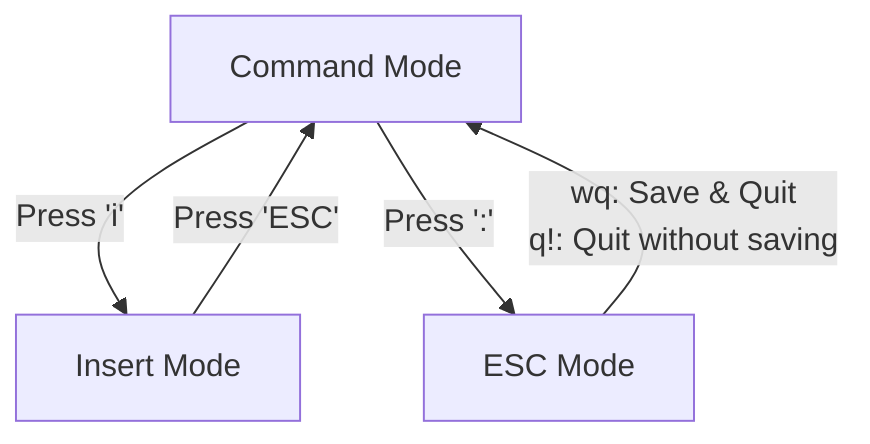

# 05_lect_08_Feb_2025_linux2_aws_devops

## Introduction
In this comprehensive guide, we'll explore essential Linux commands for file management, text manipulation, and editing. Understanding these commands is crucial for DevOps engineers and AWS practitioners.

## File Management Fundamentals

### Moving and Renaming Files
The `mv` command serves two primary purposes in Linux:
```bash
# For renaming files
mv <present-name> <new-name>

# For moving files between locations
mv <present-location-filename> <new-location>
```
Think of `mv` as similar to the cut-and-paste function in graphical interfaces, but more powerful and flexible.

### File Deletion System
Linux provides several methods for removing files and directories:
```bash
# Remove individual files
rm <filename>

# Remove directories containing files
rm -rf <dir-name>   # Be cautious with this command!

# Remove empty directories
rmdir
```
Important note: Unlike graphical interfaces, Linux doesn't have a "Recycle Bin." When you delete files using these commands, they're permanently removed.

### Command History
```bash
history    # Shows your command timeline
```
This command is particularly useful for DevOps professionals who need to track their system interactions or repeat complex commands.

## Working with File Content

### File Creation and Data Management
```bash
# Create and write to a new file
cat > f1.txt    # Press Ctrl+D when finished

# Add more data to existing file
cat >> f1.txt

# View file contents
cat f1.txt      # Standard view
cat -n f1.txt   # Numbered lines for better reference
```

### Advanced File Viewing Techniques
```bash
# Reverse content viewing (bottom to top)
tac f1.txt

# Character and word reversal
rev f1.txt

# View initial portions of files
head f1.txt         # First 10 lines by default
head -n 14 f1.txt   # Customize to show first 14 lines
head -n 5 f1.txt    # First 5 lines

# View ending portions of files
tail f1.txt         # Last 10 lines by default
tail -n 5 f1.txt    # Adjust to show last 5 lines
```

## Advanced File Operations

### File Duplication
```bash
# Basic file copying
cp f1.txt f2.txt    # Creates f2.txt with f1.txt's content

# Merge multiple files
cat f1.txt f2.txt > f3.txt   # Combines contents into f3.txt
```

### Pattern Searching with grep
The Global Regular Expression Print (grep) command is invaluable for text analysis:
```bash
# Standard search
grep 'aws' f1.txt           # Finds 'aws' occurrences

# Case-insensitive search
grep -i 'AWS' f1.txt        

# Search with line numbers
grep -n 'aws' f1.txt

# Inverse search (excluding matches)
grep -v 'aws' f1.txt

# Directory-wide search
grep 'aws' *   # Searches all files in current directory
```

## Text Editing in Linux

### VI Editor: A Deep Dive
The VI editor operates in three distinct modes:



Essential VI commands:
- Enter VI: `vi <filename>`
- Start editing: Press 'i'
- Save changes: `:wq`
- Discard changes: `:q!`
 

### File Creation Methods
```bash
# Directory creation
mkdir <file-name>

# Empty file creation
touch <filename>

# Create file with content
cat > <filename>

# Create for editing
vi <filename>
```

## Utility Commands

### File Analysis
```bash
# Count lines, words, and characters
wc f1.txt

# Compare two files
diff f1.txt f2.txt
```

### Stream Editor (SED)
SED is a powerful stream editor for transforming text. It's particularly useful in DevOps for automated file modifications and text processing pipelines.

## Best Practices and Tips

1. Always verify the current directory before executing deletion commands
2. Create backups of important files before major modifications
3. Use meaningful filenames for better organization
4. Combine commands to create more efficient workflows
5. Practice VI commands regularly to build muscle memory
