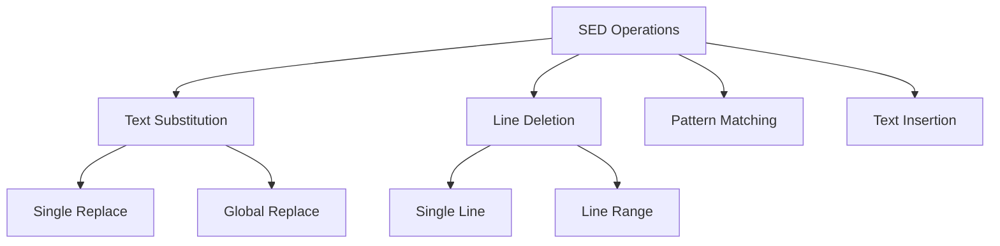
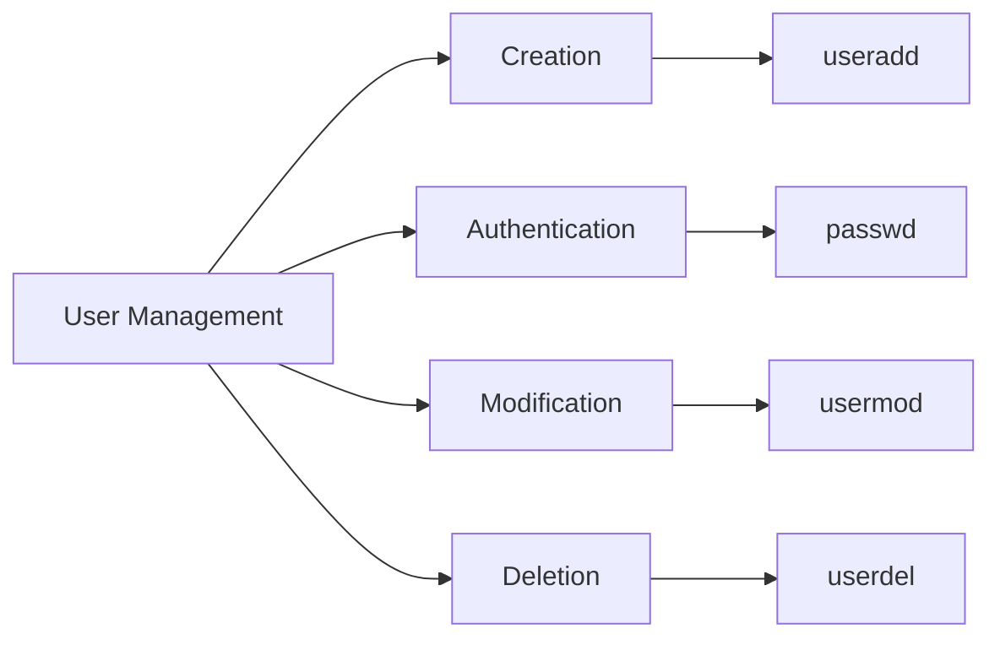
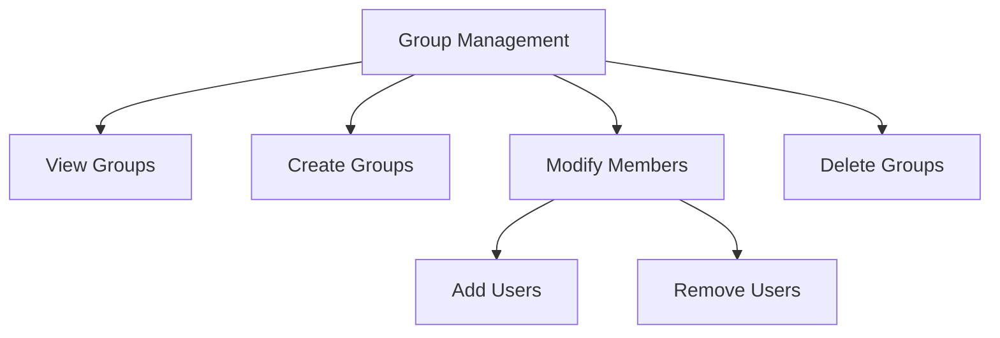
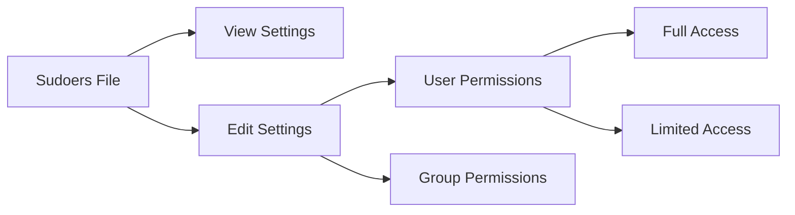

 # 06_lect_09_Feb_2025_linux3

## 1. SED Command (Stream Editor)
SED is a powerful stream editor in Linux for basic text transformations on an input stream (a file or input from a pipeline).

### Text Substitution Operations
```bash
# Basic substitution syntax
sed 's/old/new/' filename      # Replace first occurrence in each line
sed 's/old/new/2' f1.txt      # Replace second occurrence in each line
sed 's/old/new/g' f1.txt      # Replace all occurrences in each line

# Example:
# If file.txt contains: "hello hello hello"
# sed 's/hello/hi/2' file.txt will output: "hello hi hello"
```

### Line Deletion Operations
```bash
# Delete specific lines
sed -i '3d' f1.txt            # Delete third line
sed -i '$d' f1.txt            # Delete last line
sed -i 'n,5d' f1.txt          # Delete from nth to 5th line
sed -i '3,6d' f1.txt          # Delete from 3rd to 6th line
```

### Pattern Matching Operations
```bash
# Search and manipulate based on patterns
sed -n '/python/p' f1.txt     # Print lines containing 'python'
sed '/python/d' f1.txt        # Delete lines containing 'python'
```

### Text Insertion Operations
```bash
# Add text at specific positions
sed '3i text' f1.txt          # Insert text before 3rd line
sed '$a text' f1.txt          # Append text after last line
```



## 2. User Management in Linux
Linux is a multi-user operating system where multiple users can work simultaneously.

### User Creation and Authentication
```bash
# Create and set up new users
sudo useradd <username>        # Create new user
sudo passwd <username>         # Set user password
sudo su <username>            # Switch to user
cd ~                         # Navigate to home directory
exit                        # Exit current user session
```

### User Modification and Deletion
```bash
# Modify or remove users
sudo userdel <username>       # Delete user (preserve home directory)
sudo userdel -r <username>    # Delete user and home directory
sudo usermod -l <newname> <oldname>  # Rename user
```



## 3. Group Management
Groups help organize users and control access permissions collectively.

### Basic Group Operations
```bash
# View and create groups
cat /etc/group                # List all groups
sudo groupadd <groupname>     # Create new group
id <username>                # Show user's group details
```

### Group Membership Management
```bash
# Modify group memberships
sudo usermod -aG <groupname> <username>  # Add user to group
sudo gpasswd -d <username> <groupname>   # Remove user from group
sudo lid -g <groupname>                  # List group members
```

### Group Administration
```bash
# Modify or remove groups
sudo groupdel <groupname>               # Delete group
sudo groupmod -n <newname> <oldname>    # Rename group
```



## 4. Sudoers Configuration
The sudoers file controls which users can execute commands with elevated privileges.

### Basic Sudoers Operations
```bash
# Access and modify sudoers file
sudo cat /etc/sudoers        # View sudoers file
sudo visudo                  # Edit sudoers file safely

# Standard permission format
username ALL=(ALL:ALL) ALL   # Grant full sudo access
```

> **Important**: Exercise extreme caution when editing sudoers file. Incorrect syntax can break system security.

