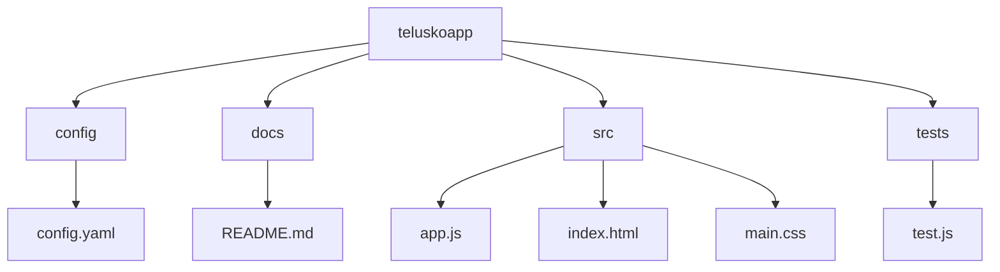

# 11_lect_01_Mar_2025_scripting2

## Command Line Arguments in Shell Scripting

## Introduction
Command-line arguments allow passing values or data to a script at execution time. This makes scripts dynamic and flexible.

### Syntax
```sh
$ sh script.sh arg1 arg2
```
- `$#` : Total number of arguments passed.
- `$0` : Script file name.
- `$1` : First command-line argument.
- `$2` : Second command-line argument.
- `$@` : All command-line arguments.

### Example: Sum of Two Numbers
```sh
#!/bin/bash
RESULT=$(($1+$2))
echo "Sum of Data passed is : $RESULT"
```
#### Execution
```sh
$ sh 13-script.sh 4 4
Sum of Data passed is : 8
```

### Example: Display Command-line Arguments
```sh
#!/bin/bash
echo "Total Args/info passed : $#"
echo "Script file name : $0"
echo "First Command Line Arg: $1"
echo "Second Command Line Arg: $2"
echo "All Command Line Args: $@"
```

## Comments in Shell Scripting
- `#` : Used for single-line comments.
- Multi-line comments:
```sh
<<COMMENT
This is a multi-line comment.
COMMENT
```

## Redirecting Output to a Log File
Output can be redirected using `>` (overwrite) and `>>` (append).

### Example:
```sh
$ command > logfile.txt  # Overwrites content
$ command >> logfile.txt # Appends content
```

### Example Execution:
```sh
date > telusko.txt
cat telusko.txt
pwd > telusko.txt
cat telusko.txt
date >> telusko.txt
cat telusko.txt
```

## Logging in Shell Scripts
```sh
#!/bin/bash
LOG_FILE=myapp.log

log_message(){
    local timestamp=$(date +"%Y-%m-%d %T")
    local message=$1
    echo "[$timestamp] $message" >> $LOG_FILE
}

log_message "Script Execution Started"
echo "This is something regular message - 01"
echo "This is something regular message - 02"
mkdir java &> $LOG_FILE
log_message "Script Execution Completed"
```

## System Information Script
```sh
#!/bin/bash
echo "Date & Time : $(date)"
echo "Hostname : $(hostname)"
echo "System Uptime : $(uptime)"
echo "Disk Usage:"
df -h
echo "Memory Usage:"
free -h
```

## Log Analysis Script
```sh
#!/bin/bash
LOG_FILE="/var/log/syslog"
ERROR_COUNT=$(grep -c "ERROR" "$LOG_FILE")
echo "Number of errors in system log file : $ERROR_COUNT"
```

## File Backup Script using Tar
```sh
#!/bin/bash
SOURCE_DIR=/home/ubuntu
TARGET_DIR=/home/ubuntu
echo "Backup process starting..."
tar -czvf "$SOURCE_DIR/backup_$(date +%Y%m%d).tar.gz" "$TARGET_DIR"
echo "Backup completed with a tar file"
```

## Creating a Project Structure with Shell Script
### Folder Structure

### Shell Script
```sh
#!/bin/bash
PROJECT_NAME="teluskoapp"
ROOT_DIR=$(pwd)

create_project(){
    mkdir $1
    mkdir $1/src
    mkdir $1/tests
    mkdir $1/docs
    mkdir $1/config
    touch $1/config/config.yaml
    touch $1/docs/README.md
    touch $1/src/app.js
    touch $1/src/main.css
    touch $1/src/index.html
    touch $1/tests/test.js
}

create_project $ROOT_DIR/$PROJECT_NAME
```

### Display Project Structure
```sh
tree teluskoapp
```

## Cron Job for Scheduling Scripts
Cron jobs allow scheduling shell scripts for automation. Example:
```sh
crontab -e
```
Add the following line to run a script every day at midnight:
```sh
0 0 * * * /path/to/script.sh
```

---
This structured guide covers the shell scripting concepts extracted from your images.

